# Overview of the Exnaton Coding challenge

This is the official code repository of the project 'Exnaton_challenge'. This repository contains utilities for:
- Exploratory Data Analysis of the energy data retrieved from the following API
  - [95ce3367-cbce-4a4d-bbe3-da082831d7bd.json](https://exnaton-public-s3-bucket20230329123331528000000001.s3.eu-central-1.amazonaws.com/challenge/95ce3367-cbce-4a4d-bbe3-da082831d7bd.json)
  - [1db7649e-9342-4e04-97c7-f0ebb88ed1f8.json](https://exnaton-public-s3-bucket20230329123331528000000001.s3.eu-central-1.amazonaws.com/challenge/1db7649e-9342-4e04-97c7-f0ebb88ed1f8.json)

- Implementing an ELT pipeline to extract data from the source (API) and load it into the appropriate destination (database).
  At a high level, we're going to:
  - Extract and Load data from source to destination.
  - Transform data for downstream applications.

## Details of the challenge
Task is divided into 2 parts

Task A - Data Exploration  
- Explore the data and group it by different time intervals. Explain what you see/what the data represents. Come up with a hypothesis on what kind of data you are looking at.
- Bonus: Check for any autocorrelation within the time-series data.

Task B - Backend  
- Please retrieve the data from the GET endpoint and store it in a database of your choice.
- Write an endpoint to access the data from a frontend application. Which kind of query parameters might be useful to access the data from the frontend? Document your API for your fellow frontend developer.
- Bonus: Provide environment files and/or Deployment files (dockerfile, docker-compose, k8s resource definitions) to deploy the backend.

## Overview of Solution  
### Task A - Data Exploration   
Initial details of the data:
- Data extracted corresponds to 2 units with muid "95ce3367-cbce-4a4d-bbe3-da082831d7bd" and "1db7649e-9342-4e04-97c7-f0ebb88ed1f8"
- For the 2 units meter data is extracted to get the energy consumption for the month of February 2023

### Specifications  
#### Unit "95ce3367-cbce-4a4d-bbe3-da082831d7bd" 
- Data contains the following parameters
  - measurement (unique values: energy)
  - timestamp
  - 0100011D00FF (energy units consumed)
  - muid (unique values: 95ce3367-cbce-4a4d-bbe3-da082831d7bd)
  - quality (unique values: measured)
  
  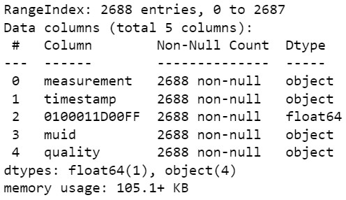

- Sampling rate
  - Data is extracted every 15 minutes of the day from 00:00:00, 01.02.2023 until 23:45:00, 28.02.2023
- Entity measured
  - Energy
- Missing values
  - None
    
  

#### Unit "1db7649e-9342-4e04-97c7-f0ebb88ed1f8" 
- Data contains the following parameters
  - measurement (unique values: energy)
  - timestamp
  - 0100021D00FF (energy units consumed)
  - muid (unique values: 1db7649e-9342-4e04-97c7-f0ebb88ed1f8)
  - quality (unique values: measured)
  
  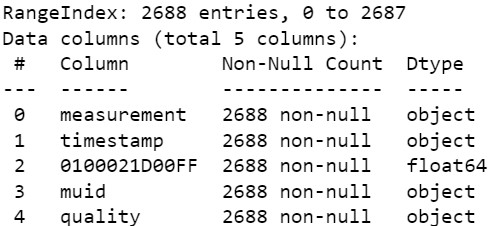

- Sampling rate
  - Data is extracted every 15 minutes of the day from 00:00:00, 01.02.2023 until 23:45:00, 28.02.2023
- Entity measured
  - Energy
- Missing values
  - None
    
  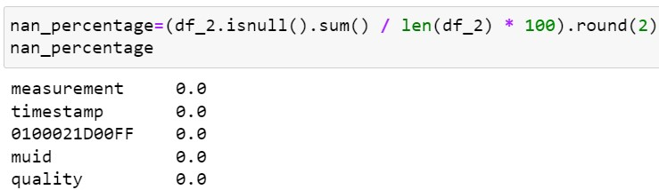

### Visualization of the time series data 
#### Energy consumption of unit 95ce3367-cbce-4a4d-bbe3-da082831d7bd for the month of February 2023
  
  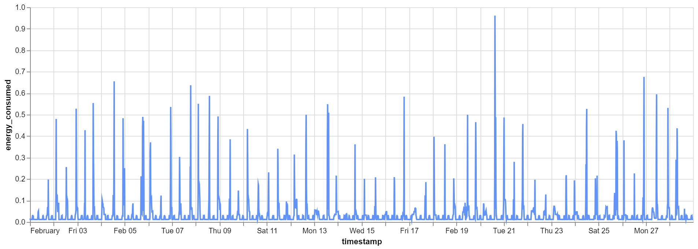

#### Observations from the Plot:
- Regular Spikes: There are significant spikes in energy consumption that occur regularly, possibly indicating events or activities that lead to higher energy use. These spikes seem to occur daily, with varying intensities. No clear pattern is visible
- Low Baseline Consumption: There is a consistent low level of consumption throughout most of the day, which likely represents a baseline level of energy usage that remains relatively constant.
  
  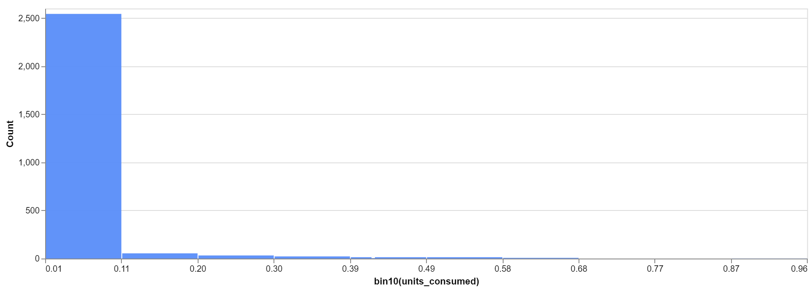  

   - Majority consumption is baseline in the range of 0.0114 to 0.1063 units
   - Maximum energy consumed is 0.9612 units
   - Total energy consumed for the month of February is 97.6082 units
 
#### Energy consumption of unit 1db7649e-9342-4e04-97c7-f0ebb88ed1f8 for the month of February 2023
  
  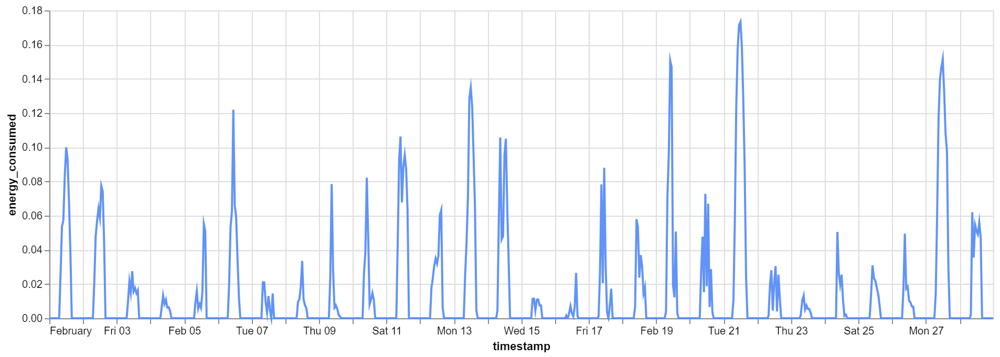

#### Observations from the Plot:
- Regular Spikes: There are significant spikes in energy consumption that occur regularly, possibly indicating events or activities that lead to higher energy use. These spikes seem to occur daily, with varying intensities. No clear pattern is visible
- Low Baseline Consumption: There is a consistent low level of consumption throughout most of the day, which likely represents a baseline level of energy usage that remains relatively constant.
  
  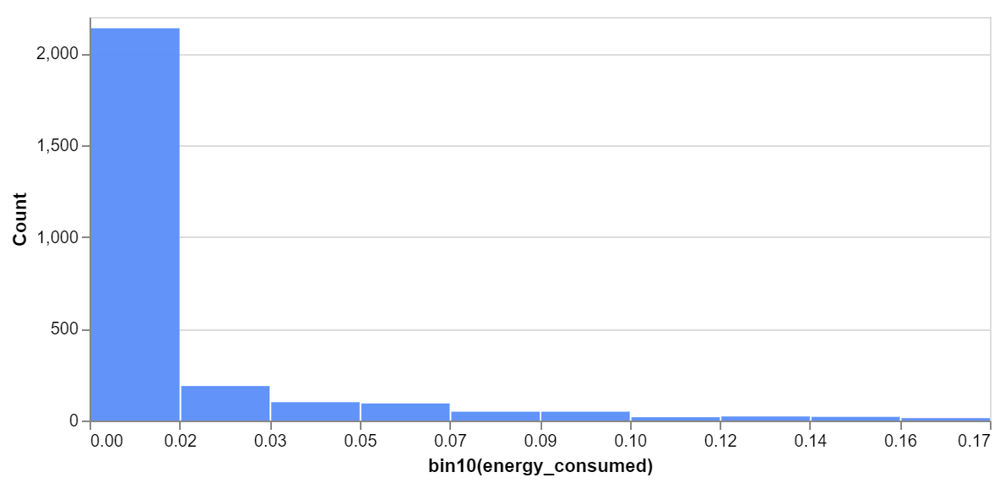  

   - Majority consumption is baseline in the range of 0.0114 to 0.1063 units
   - Maximum energy consumed is 0.9612 units
   - Total energy consumed for the month of February is 97.6082 units

#### Weekly variations  

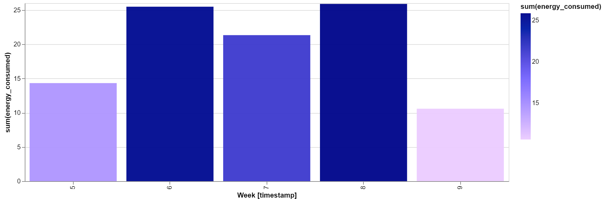  

- X-axis represents the week number of the year 2023
- Energy consumption is high in the 2nd, 3rd and 4th week of February

#### Weekday variations 

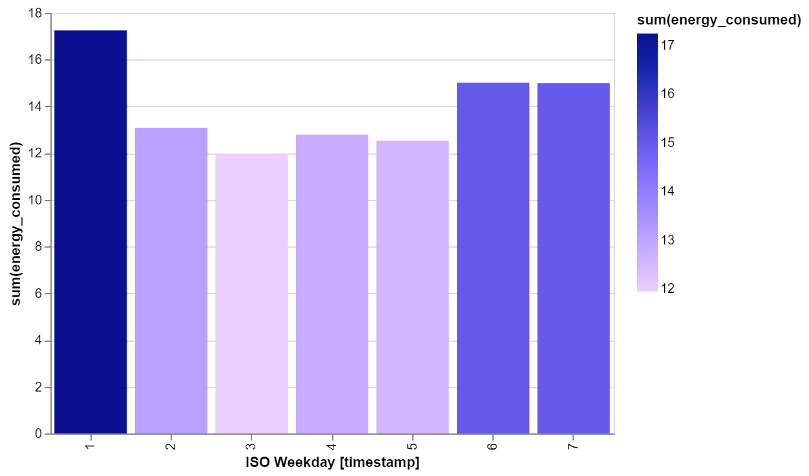  

- X-axis represents the day of the week in the ISO format where 1 = Monday and 7 = Sunday
- Energy consumption is high on Saturdays, Sundays and Mondays

#### Daily variations  

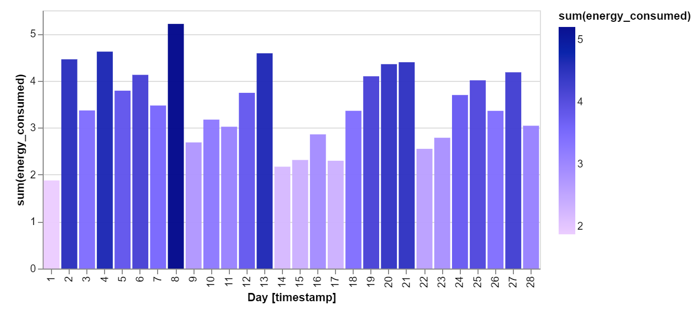  

- Observation
  - There is a noticeable peak in energy consumption on the 8th and 13th of February. Other days show varying levels of energy use, with some lower consumption days scattered throughout the month.

- Potential Hypothesis
  - The spikes on the 8th and 13th could correlate with specific events or activities that occurred on these days, such as a high-demand production run, a special event in an office building, or maintenance activities requiring more energy. The variability across the month suggests that energy use is not consistent and may be influenced by operational requirements or specific external factors on certain days.

#### Hourly variations  

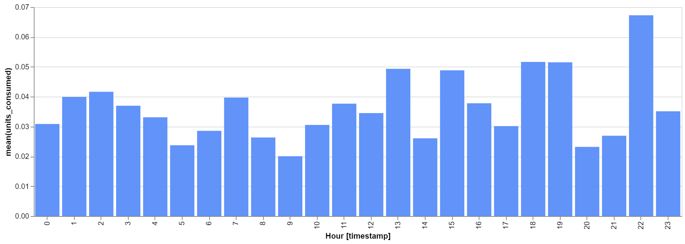  

- Observation
  - There are distinct peaks in energy consumption during specific hours, particularly around 1 AM, 6 AM, 1 PM, and 10 PM. The highest peak appears around 10 PM.
- Potential Hypothesis
  - The hourly energy consumption pattern suggests that there may be scheduled activities or automated processes occurring at these specific times. For example, the high energy use at 10 PM could indicate a nightly process, such as data backups, machinery shutdown routines, or heating/cooling systems kicking in during off-hours. The spike at 1 PM may correspond to lunchtime activities or a specific production shift, while the 6 AM peak could be tied to early morning startup activities.
 
#### Hypothesis for the unit with muid "95ce3367-cbce-4a4d-bbe3-da082831d7bd"

The energy consumption data likely corresponds to a facility with specific operational events or automated processes that trigger significant energy use at certain times and on specific days. Peaks in daily energy consumption on the 8th and 13th suggest extraordinary activities or events, while the hourly peaks indicate regular scheduled processes, possibly aligned with shift changes, maintenance routines, or automated systems that operate at specific times of the day.

  - Daily Spikes: The unusual peaks on specific days suggest events or operations that do not occur regularly. Identifying what happened on these days could help explain the higher energy usage.
  - Hourly Peaks: The regularity of the hourly spikes implies recurring events, likely tied to the operational schedule of the facility, such as shift changes or routine processes.

  

 
