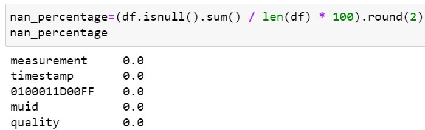

# Overview of the Exnaton Coding challenge

This is the official code repository of the project 'Exnaton_challenge'. This repository contains utilities for:
- Exploratory Data Analysis of the energy data retrieved from the following API
  - [95ce3367-cbce-4a4d-bbe3-da082831d7bd.json](https://exnaton-public-s3-bucket20230329123331528000000001.s3.eu-central-1.amazonaws.com/challenge/95ce3367-cbce-4a4d-bbe3-da082831d7bd.json)
  - [1db7649e-9342-4e04-97c7-f0ebb88ed1f8.json](https://exnaton-public-s3-bucket20230329123331528000000001.s3.eu-central-1.amazonaws.com/challenge/1db7649e-9342-4e04-97c7-f0ebb88ed1f8.json)

- Implementing an ELT pipeline to extract data from the source (API) and load it into the appropriate destination (database).
  At a high level, we're going to:
  - Extract and Load data from source to destination.
  - Transform data for downstream applications.

## Details of the challenge
Task is divided into 2 parts

Task A - Data Exploration  
- Explore the data and group it by different time intervals. Explain what you see/what the data represents. Come up with a hypothesis on what kind of data you are looking at.
- Bonus: Check for any autocorrelation within the time-series data.

Task B - Backend  
- Please retrieve the data from the GET endpoint and store it in a database of your choice.
- Write an endpoint to access the data from a frontend application. Which kind of query parameters might be useful to access the data from the frontend? Document your API for your fellow frontend developer.
- Bonus: Provide environment files and/or Deployment files (dockerfile, docker-compose, k8s resource definitions) to deploy the backend.

## Overview of Solution  
### Task A - Data Exploration   
Initial details of the data:
- Data extracted corresponds to 2 units with muid "95ce3367-cbce-4a4d-bbe3-da082831d7bd" and "1db7649e-9342-4e04-97c7-f0ebb88ed1f8"
- For the 2 units meter data is extracted to get the energy consumption for the month of February 2023

### EDA of unit "95ce3367-cbce-4a4d-bbe3-da082831d7bd" 
- Data contains the following parameters
  - measurement (unique values: energy)
  - timestamp
  - 0100011D00FF (energy units consumed)
  - muid (unique values: 95ce3367-cbce-4a4d-bbe3-da082831d7bd)
  - quality (unique values: measured)
  
  

- Sampling rate
  - Data is extracted every 15 minutes of the day from 00:00:00, 01.02.2023 until 23:45:00, 28.02.2023
- Entity measured
  - Energy
- Missing values
  - None
    
  

- Visualize the time series data representing energy consumption of unit 95ce3367-cbce-4a4d-bbe3-da082831d7bd for the month of February 2023
  
  

 - Observations from the Plot:
   - Regular Spikes: There are significant spikes in energy consumption that occur regularly, possibly indicating events or activities that lead to higher energy use. These spikes seem to occur daily, with varying intensities. No clear pattern is visible
   - Low Baseline Consumption: There is a consistent low level of consumption throughout most of the day, which likely represents a baseline level of energy usage that remains relatively constant. 

  

 
