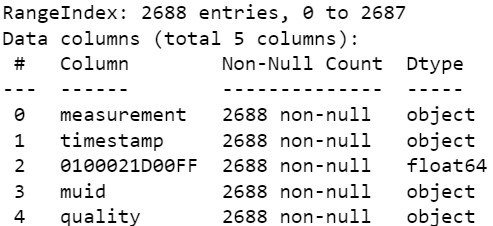
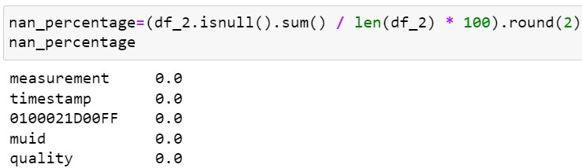
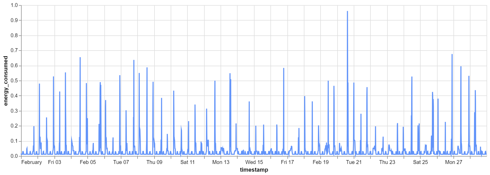
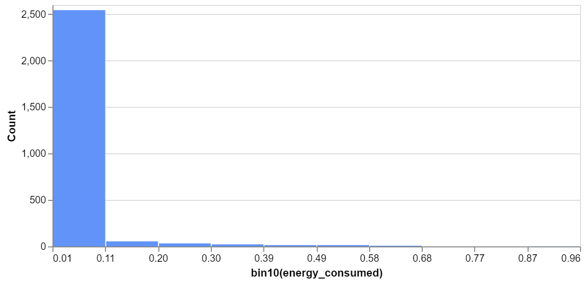
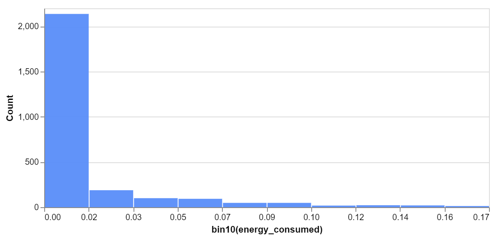
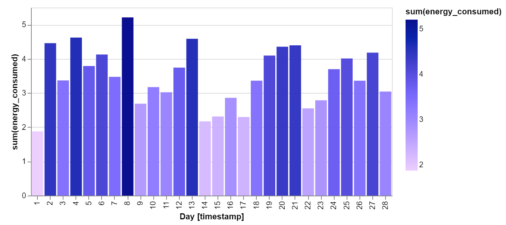
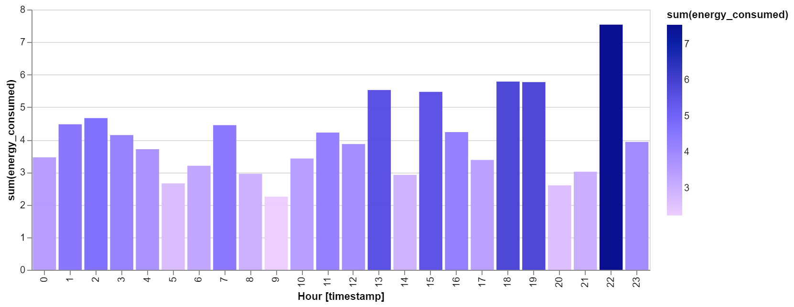
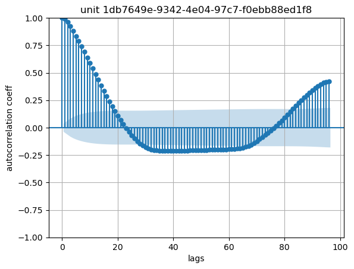

## Overview of Solution  
### Task A - Data Exploration   
Initial details of the data:
- Data extracted corresponds to 2 units with muid "95ce3367-cbce-4a4d-bbe3-da082831d7bd" and "1db7649e-9342-4e04-97c7-f0ebb88ed1f8"
- For the 2 units meter data is extracted to get the energy consumption for the month of February 2023

### Specifications  
#### Unit "95ce3367-cbce-4a4d-bbe3-da082831d7bd" 
- Data contains the following parameters
  - measurement (unique values: energy)
  - timestamp
  - 0100011D00FF (energy units consumed)
  - muid (unique values: 95ce3367-cbce-4a4d-bbe3-da082831d7bd)
  - quality (unique values: measured)
  
  

- Sampling rate
  - Data is extracted every 15 minutes of the day from 00:00:00, 01.02.2023 until 23:45:00, 28.02.2023
- Entity measured
  - Energy
- Missing values
  - None
    
  

#### Unit "1db7649e-9342-4e04-97c7-f0ebb88ed1f8" 
- Data contains the following parameters
  - measurement (unique values: energy)
  - timestamp
  - 0100021D00FF (energy units consumed)
  - muid (unique values: 1db7649e-9342-4e04-97c7-f0ebb88ed1f8)
  - quality (unique values: measured)
  
  

- Sampling rate
  - Data is extracted every 15 minutes of the day from 00:00:00, 01.02.2023 until 23:45:00, 28.02.2023
- Entity measured
  - Energy
- Missing values
  - None
    
  

### Visualization of the time series data 
#### Energy consumption of unit 95ce3367-cbce-4a4d-bbe3-da082831d7bd for the month of February 2023
  
  

#### Observations from the Plot:
- Spikes: There are significant spikes in energy consumption that occur regularly, possibly indicating events or activities that lead to higher energy use. These spikes seem to occur daily, with varying intensities. No clear pattern is visible
- Low Baseline Consumption: There is a consistent low level of consumption throughout most of the day, which likely represents a baseline level of energy usage that remains relatively constant.
  
    

   - Majority consumption is baseline in the range of 0.0114 to 0.1063 units
   - Maximum energy consumed is 0.9612 units
   - Total energy consumed for the month of February is 97.6082 units
 
#### Energy consumption of unit 1db7649e-9342-4e04-97c7-f0ebb88ed1f8 for the month of February 2023
  
  

#### Observations from the Plot:
- Spikes: There are sharp spikes in energy consumption at irregular intervals throughout the month. These spikes indicate short bursts of high energy usage, followed by periods of little energy consumption. The spikes are not evenly distributed, with some days showing multiple spikes and others with little activity. The pattern suggests that the events leading to high energy consumption are likely not daily but instead occur sporadically, possibly tied to specific activities or events.  
- Low or No Baseline Consumption: Between the spikes, the energy consumption drops to nearly zero or very low values, indicating periods of inactivity or minimal energy usage.
  
    

   - Majority consumption is baseline in the range of 0.0000 to 0.0173 units
   - Maximum energy consumed is 0.1732 units
   - Total energy consumed for the month of February is 36.1972 units

### Weekly variations 
#### Unit "95ce3367-cbce-4a4d-bbe3-da082831d7bd"

  

- X-axis represents the week number of the year 2023
- Energy consumption is high in the 2nd, 3rd and 4th week of February

#### Unit "1db7649e-9342-4e04-97c7-f0ebb88ed1f8"  

  

- X-axis represents the week number of the year 2023
- Energy consumption is high in the 2nd, 3rd and 4th week of February

### Weekday variations  
#### Unit "95ce3367-cbce-4a4d-bbe3-da082831d7bd"

  

- X-axis represents the day of the week in the ISO format where 1 = Monday and 7 = Sunday
- Energy consumption is high on Saturdays, Sundays and Mondays

#### Unit "1db7649e-9342-4e04-97c7-f0ebb88ed1f8"  

  

- X-axis represents the day of the week in the ISO format where 1 = Monday and 7 = Sunday
- Energy consumption is very high on Mondays and Tuesdays

### Daily variations  
#### Unit "95ce3367-cbce-4a4d-bbe3-da082831d7bd"

  

- Observation
  - There is a noticeable peak in energy consumption on the 8th and 13th of February. Other days show varying levels of energy use, with some lower consumption days scattered throughout the month.

- Potential Hypothesis
  - The spikes on the 8th and 13th could correlate with specific events or activities that occurred on these days, such as a high-demand production run, a special event in an office building, or maintenance activities requiring more energy. The variability across the month suggests that energy use is not consistent and may be influenced by operational requirements or specific external factors on certain days.
 
#### Unit "1db7649e-9342-4e04-97c7-f0ebb88ed1f8"

  

- Observation
  - The energy consumption varies significantly day-to-day, with noticeable peaks on the 21st and 27th of February. These days show a sharp increase in energy use compared to the rest of the month, while other days mostly show relatively lower energy consumption.
- Potential Hypothesis
  - The spikes on the 21st and 27th suggest that these days involved high-energy-demand activities, possibly related to scheduled processes, events, or operations that are not part of the regular daily routine. This could be a monthly deep cleaning operation, system-wide testing, or a major production run requiring extensive use of equipment.
    
### Hourly variations  
#### Unit "95ce3367-cbce-4a4d-bbe3-da082831d7bd"

  

- Observation
  - There are distinct peaks in energy consumption during specific hours, particularly around 1 PM, 3 PM, 6 PM, 7 PM and 10 PM. The highest peak appears around 10 PM.
- Potential Hypothesis
  - The hourly energy consumption pattern suggests that there may be scheduled activities or automated processes occurring at these specific times. For example, the high energy use at 10 PM could indicate a nightly process, such as data backups, machinery shutdown routines, or heating/cooling systems. The spike at 1 PM may correspond to lunchtime activities.
 
#### Unit "1db7649e-9342-4e04-97c7-f0ebb88ed1f8"  

  

- Observation
  - The energy consumption is heavily concentrated between 7 AM and 3 PM, with the highest usage occurring around 9 AM to 13 PM. There is very little energy consumption outside of these hours.

- Potential Hypothesis
  - The pattern suggests that the facility is primarily operational during the morning to early afternoon hours involving the most energy-intensive activities, such as running machinery or peak operational demand.
 
### Hypothesis for the unit with muid "95ce3367-cbce-4a4d-bbe3-da082831d7bd"

The energy consumption data likely corresponds to a facility with regular scheduled processes/recurring events, such as shift changes, maintenance routines etc with specific events or automated processes that trigger significant energy use at certain times and on specific days. 

The regularity of the hourly spikes implies recurring events.

### Hypothesis for the unit with muid "1db7649e-9342-4e04-97c7-f0ebb88ed1f8"

The energy consumption data likely represents a facility where operations are concentrated during the early to mid-morning hours. A structured work schedule with peak demand in the morning, likely driven by specific high-energy processes.

The clustering of energy consumption around the late morning and early afternoon hours supports the idea that this is the primary period for operational activities, with the highest demand occurring when the facility is most active.

### Autocorrelation  
   
 

  

 
