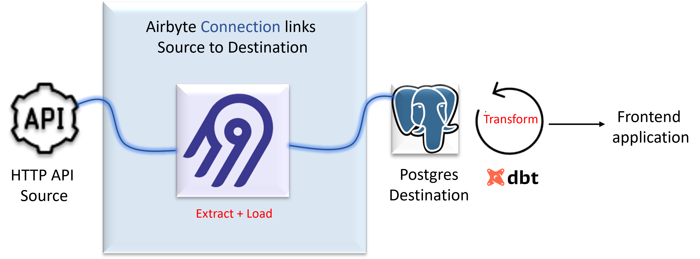
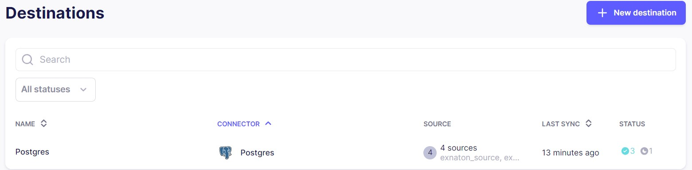
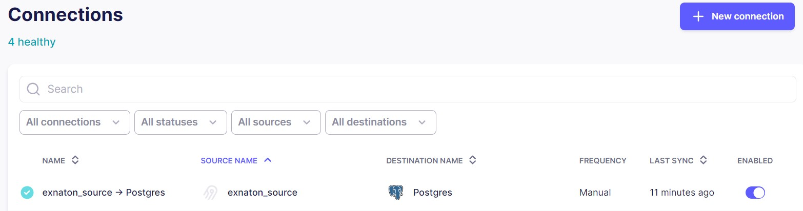
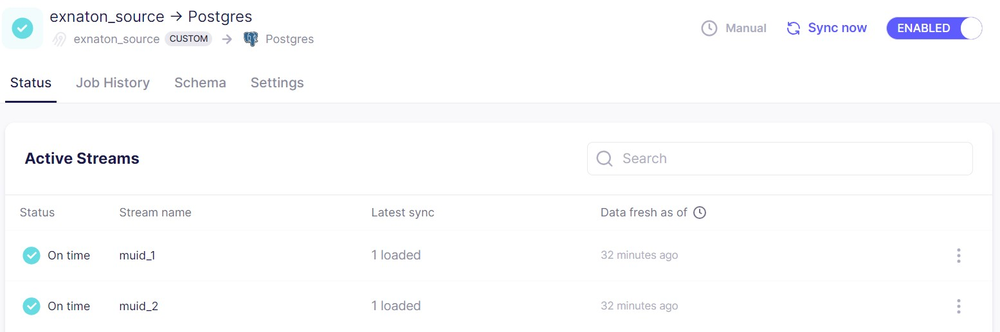

## Task B - Backend

At a high level, we're going to:
- Extract and Load data from source (HTTP API) to destination (Postgres)
- Transform data for downstream applications.
- Write an endpoint to access the data from a frontend application.
  
This process is more commonly known as ELT, but there are variants such as ETL and reverse ETL, etc. They are all essentially the same underlying workflows but have slight differences in the order of data flow and where data is processed and stored.

### Overview of solution  

  

### Technology  
1. Airbyte open source 0.63.5
2. dbt core 1.8.3
3. Flask 3.0.3
4. Docker 24.0.6

### Airbyte open source 
### Extract and Load  
The first step in our data pipeline is to extract data from the source and load it into the appropriate destination. We're going to use the open-source tool [Airbyte](https://docs.airbyte.com/using-airbyte/getting-started/) v0.63.5 to create connections between our data sources and destinations. Airbyte enables creating pipelines that can be scaled, monitored etc

### Source  
A source is an API, file, database, or data warehouse that you want to ingest data from. The configured source is what you set up when you provide the variables needed for the connector to access records.  

Our source is an HTTP API.  
- base: url https://exnaton-public-s3-bucket20230329123331528000000001.s3.eu-central-1.amazonaws.com/challenge
- endpoint 1: 95ce3367-cbce-4a4d-bbe3-da082831d7bd.json
- endpoint 2: 1db7649e-9342-4e04-97c7-f0ebb88ed1f8.json

#### Define HTTP API source in Airbyte  
Airbyte does not have a prebuilt HTTP API source. The custom source will have to built using Airbyte's Connector Builder utility. Please follow this [tutorial](https://docs.airbyte.com/connector-development/connector-builder-ui/tutorial) to define and create the source. Our source will have 2 streams representing the 2 API endpoints. 


### Destination  
A destination is a data warehouse, data lake, database, or an analytics tool where you want to load your ingested data.  
#### Define Postgres destination in Airbyte  
Configure destination using the prebuilt Postgres destination  



### Connection  
A connection is an automated data pipeline that replicates data from a source to a destination. It links a configured source (based on a source connector) to a configured destination (based on a destination connector) to perform syncs. It defines things like the replication frequency (e.g. hourly, daily, manually) and which streams to replicate.
#### Create the connection  
Configure the connection between the previously defined source and destination  

  

##### Connection configuration 

- Streams
  - muid_1: 95ce3367-cbce-4a4d-bbe3-da082831d7bd.json
  - muid_2: 1db7649e-9342-4e04-97c7-f0ebb88ed1f8.json
- Sync mode:
  - Full refresh, Append
- Schedule type:
  - Manual
- To sync the data into the postgres database, manually click on the 'Sync now' option


  
- Other methods to sync data include: 
  - Scheduled with replication frequency (eg. every 24 hours)
  - Cron
 
### dbt core  
### Transform  
- Once we've extracted and loaded our data, we need to transform the data so that it's ready for downstream applications.
- dbt delivers production functionality around version control, testing, documentation, packaging, etc. out of the box. This becomes crucial for maintaining observability and high quality data workflows.
- Install dbt core and dbt postgres
  
  ```python -m pip install dbt-core dbt-postgres```

- The `dbt init` command is used to initialize a new dbt project. When you run the `dbt init` command, dbt will create a new directory with the necessary structure and configuration files for a dbt project.
  
  ```cd dbt_project```
  
  ```dbt init transforms```

- Enter correct postgres details to setup the connection between dbt and postgres
```
      dbname: exnaton_test
      host: localhost
      pass: password
      port: 5432
      schema: public
      threads: 1
      type: postgres
      user: username
```
- This will create a new dbt project in the dbt_project directory, with the following structure:   
```
    ├── dbt_project
        ├── logs
        ├── transforms
            ├──analyses
            ├──macros
            ├──models
            ├──seeds
            ├──snapshots
            ├──tests

```
- Test the connection with `dbt debug`
- Create models to perform the transformation on postgres tables.
  - Create 2 directories in the model directory with the following structure
    ```
    ├──models
              ├──example
              ├──muid_1_transforms
                ├──muid_1_transforms.sql
                ├──schema.yaml
              ├──muid_2_transforms
                ├──muid_2_transforms.sql
                ├──schema.yaml
    ```
   - Inside our models/muid_1_transforms/muid_1_transforms.sql file we'll create a new table that performs some transformations on the original postgres table muid_1


